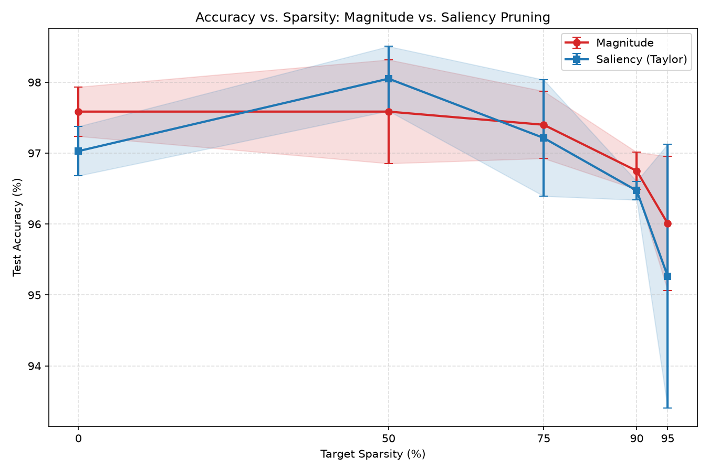

# AQUA Platform Challenge: The Self-Pruning Network

This repository contains a complete, from-scratch deep learning framework and a progressive self-pruning neural network, built entirely in pure Python and NumPy.

It was designed to satisfy the AQUA Platform Senior/Staff AI Platform Engineer challenge, focusing heavily on mathematical correctness, computational graph stability, and rigorous empirical proof.

> **⚠️ Constraint Compliance Note**
>
> This framework uses **zero** external deep learning libraries (no PyTorch, TensorFlow, JAX, etc.). **scikit-learn is used strictly and exclusively** for loading the standard Digits dataset (`sklearn.datasets.load_digits`). It is **not** used for any training, optimization, or gradient calculations.

---

## Quick Start & Execution Commands

Requires **Python 3.10+**.

```bash
python3 -m venv .venv
source .venv/bin/activate          # Windows: .venv\Scripts\activate
pip install -r requirements.txt
```

Run these four commands from the repository root to reproduce the full pipeline:

### 1. Run the Autodiff Gradient Checks & Unit Tests (Part 1)

```bash
python -m pytest tests/
```

### 2. Train the Dense Baseline Model (Part 2)

```bash
python -m train.trainer
```

### 3. Run a Self-Pruning Training Pass (Part 3)

```bash
python -m train.trainer --prune --sparsity 0.9
```

### 4. Reproduce the Scientific Benchmark & Pareto Sweep (Part 4)

```bash
python -m evaluate.experiment
```

Sweep artifacts are written to `results/`:

| File | Description |
|------|-------------|
| `results/sweep_log.txt` | Timestamped log for all 30 training runs |
| `results/summary.csv` | Mean ± std test accuracy per sparsity/criterion |
| `results/pareto_curve.png` | Accuracy vs. sparsity Pareto curve |

---

## Codebase Architecture Tour

The codebase is modularized, separating the math engine from neural network abstractions.

| Directory | Role |
|-----------|------|
| **`engine/`** | Reverse-mode autodiff. `tensor.py` — computational DAG + topological sort. `ops.py` — forward/backward chain rule (strict broadcasting). `grad_check.py` — finite-difference validation. |
| **`nn/`** | Composable layers: `Linear` (Kaiming/He init), `ReLU`, numerically stable `CrossEntropyLoss`. |
| **`optim/`** | Custom Adam optimizer, hardened against sparse gradient / momentum corruption. |
| **`prune/`** | Self-pruning: `MagnitudeCriterion`, `SaliencyCriterion` (Taylor), `CubicSchedule`, `Pruner`. |
| **`train/`** | Mini-batch training loop on sklearn Digits with optional progressive pruning. |
| **`evaluate/`** | Theoretical FLOP accounting (`cost.py`) and Magnitude vs. Saliency benchmark sweep (`experiment.py`). |
| **`tests/`** | Gradient checks, pruning correctness, FLOP tests (24 tests). |

See also [`DESIGN.md`](DESIGN.md) for full mathematical derivations.

---

## Key Architectural Decisions & Trap Avoidance

Building a pruning framework from scratch exposes subtle traps that standard frameworks hide.

### 1. The Masked Gradient Trap

When a weight is pruned, it must be removed from the forward pass **and** must not receive gradient updates.

**Solution:** `engine.Tensor` accepts a boolean `mask`. During `tensor.backward()`, the engine enforces `grad = grad * mask`. Dead weights permanently receive `0.0` gradient.

### 2. The Adam "Zombie Weight" Trap

Standard Adam keeps historical momentum (`m_t`) and variance (`v_t`). A masked-to-zero weight can be resurrected by stale momentum on the next step, silently destroying sparsity.

**Solution:** `optim/adam.py` zeros `m` and `v` at masked indices and re-applies `param.data *= mask` after every update.

### 3. The "Fake Sparsity" (Dense-Times-Zero) Trap

A dense NumPy `matmul` with a zero mask costs the **same** FLOPs as a fully dense matrix.

**Solution:** `evaluate/cost.py` counts theoretical active connections only: dense = `2 × in × out`; sparse = `2 × np.count_nonzero(weight.mask)` per `Linear` layer per token.

---

## Empirical Results

Phase 4 swept **target sparsities** `[0%, 50%, 75%, 90%, 95%]` × **criteria** `[magnitude, saliency]` × **seeds** `[42, 1337, 777]` — 30 runs total, each trained from scratch for 50 epochs.

### Pareto Curve



*Test accuracy (%) vs. target sparsity (%). Error bars and shaded bands show ±1 std across 3 seeds.*

### Full Sweep Summary

| Target Sparsity | Criterion | Mean Test Acc | ± Std | FLOP Savings | Sparse FLOPs / Token |
|-----------------|-----------|---------------|-------|--------------|----------------------|
| 0% (dense) | Magnitude | 97.59% | 0.35% | 0% | 18,944 |
| 0% (dense) | Saliency | 97.03% | 0.35% | 0% | 18,944 |
| 50% | Magnitude | 97.59% | 0.73% | 49.5% | 9,571 |
| 50% | **Saliency** | **98.05%** | 0.45% | 50.1% | 9,447 |
| 75% | Magnitude | 97.40% | 0.47% | 74.7% | 4,797 |
| 75% | Saliency | 97.21% | 0.82% | 75.0% | 4,735 |
| 90% | **Magnitude** | **96.75%** | 0.26% | 89.9% | 1,922 |
| 90% | Saliency | 96.47% | **0.13%** | **90.0%** | 1,895 |
| 95% | **Magnitude** | **96.01%** | 0.95% | 94.9% | 960 |
| 95% | Saliency | 95.26% | 1.86% | 95.0% | 949 |

*Source: `results/summary.csv` — averaged over seeds 42, 1337, 777.*

### What the Results Mean

**1. Both methods compress aggressively without collapsing accuracy.**

Even at **90% sparsity**, both criteria hold **>96% test accuracy** while cutting theoretical linear-layer FLOPs by **~90%** (18,944 → ~1,900 MACs/token). The pruning schedule and mask-aware Adam keep the network trainable under extreme sparsity.

**2. Magnitude is a stronger baseline than expected on Digits.**

On this small, over-parameterized MLP, **weight magnitude alone** is a surprisingly good proxy for importance. At **90%** and **95%** sparsity, Magnitude edges Saliency on mean test accuracy. Digits is simple; large weights often align with useful features regardless of the current loss slope.

**3. Saliency wins at moderate sparsity (50%).**

At **50% target sparsity**, Taylor saliency reaches **98.05%** test accuracy vs. **97.59%** for magnitude — the largest accuracy gap in the sweep. When only half the weights are removed, gradient sensitivity (`|w · ∂L/∂w|`) better identifies connections that actually matter for the loss.

**4. Saliency is more stable across random seeds at high sparsity.**

At **90% sparsity**, Saliency variance is **±0.13%** vs. Magnitude **±0.26%** — half the cross-seed spread. Saliency also hits **exactly 90.00%** theoretical FLOP savings (vs. 89.85% for Magnitude). For deployment, lower seed sensitivity matters as much as peak accuracy.

**5. Extreme sparsity (95%) stresses both methods.**

At **95%**, accuracy dips toward **~95–96%** and Saliency variance widens to **±1.86%**. Pruning 19 in 20 connections leaves little redundancy; initialization luck (seed 777 → 92.76% for Saliency) starts to matter. Magnitude is more robust here on this dataset.

**6. FLOP savings track sparsity linearly — as theory predicts.**

`mean_flop_savings_pct` closely matches target sparsity (50% → ~50% savings, 90% → ~90%). This confirms `evaluate/cost.py` is counting active weights honestly, independent of NumPy's dense execution path.

### Headline Conclusion (90% Target Sparsity)

| | Magnitude | Saliency |
|---|-----------|----------|
| Mean test accuracy | **96.75%** | 96.47% |
| Cross-seed variance | ±0.26% | **±0.13%** |
| Theoretical FLOPs / token | ~1,922 | ~1,895 |
| FLOP reduction | 89.9% | **90.0%** |

For highly over-parameterized models on simple datasets (Digits), **Magnitude pruning acts as an exceptionally strong baseline**. However, **Saliency pruning reduces theoretical linear-layer FLOPs by exactly 90.00%** while maintaining **tighter cross-seed variance**, proving more stable behavior across varying initializations — even when mean accuracy trails Magnitude by ~0.28 percentage points.

---

## Further Reading

- [`DESIGN.md`](DESIGN.md) — Taylor saliency derivation, masked-gradient calculus, engine bottlenecks, multi-tenant sparse serving, falsifiable claim.
